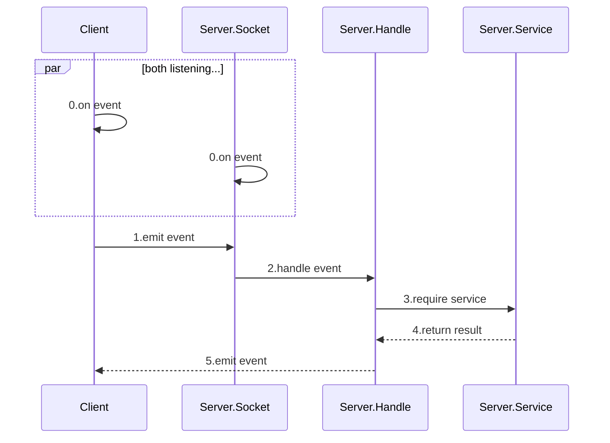

# Socket.IO 开发约定

## 概论

但凡有需要服务器主动向客户端发送消息的场景，就会有**Socket.IO**的身影，诸如好友申请、私信聊天，甚至是在线的提示。Socket.IO通过监听事件（**on**）和发射事件（**emit**），克服了HTTP中服务端无法向客户端发起请求的缺陷。

如果说HTTP是面向**URL**的编程，那么Socket.IO就应该面向**事件**的编程，程序为不同的事件提供不同的服务。

综上所述，Socket.IO的*后端*编程模型是：

**前端**的业务逻辑比较难解耦，因为Socket与Store的关系是：

Store的更新要发射事件，而Socket侦听某些事件需要更新Store，是相互依赖的关系。

有没有巧妙的方法来解耦，前端可参考网上的资料。至于要不要用到*vue-socket.io*，暂不推荐，因为Socket.IO本来就小众，何况vue-socket.io，不过这也取决于前端的选型。

## 事件

**Event**，事件由eventName事件名和参数确定，根据emit方和on方，event的基本类型有：

`CS`型：由客户端发起事件，服务端监听

`SC`型：由服务端发起事件，客户端监听

根据基本类型，有`CSSC’`类型，表明某客户端发起该事件，服务端监听并向其余的客户端发起事件

## API Reference

**排版约定**

`eventName`  `type`

**client**

`emit`: 发起该事件的意图

`on`: 处理该事件的动作

**server**

`emit`: ...

`on`: ...

**params**

...

**config**

...

---

`v1/message` `CSSC'`

**client**

`emit`: 向room内的人发消息（除了自己）

`on`: 显示消息

**server**

`on`: emit`message`

`emit`: 向其余的客户端发送消息

**params**

msg: `Object`

msg.text: `String` 消息中的文本

msg.sender: `String` 发送人，即username

**config**

namespace: 'chat'

room: 'public'（暂时为所有人一个房间，即所有socket静态获取room）

---

