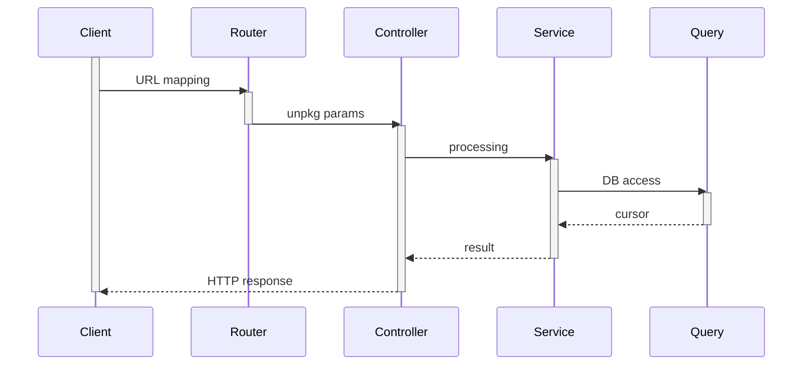
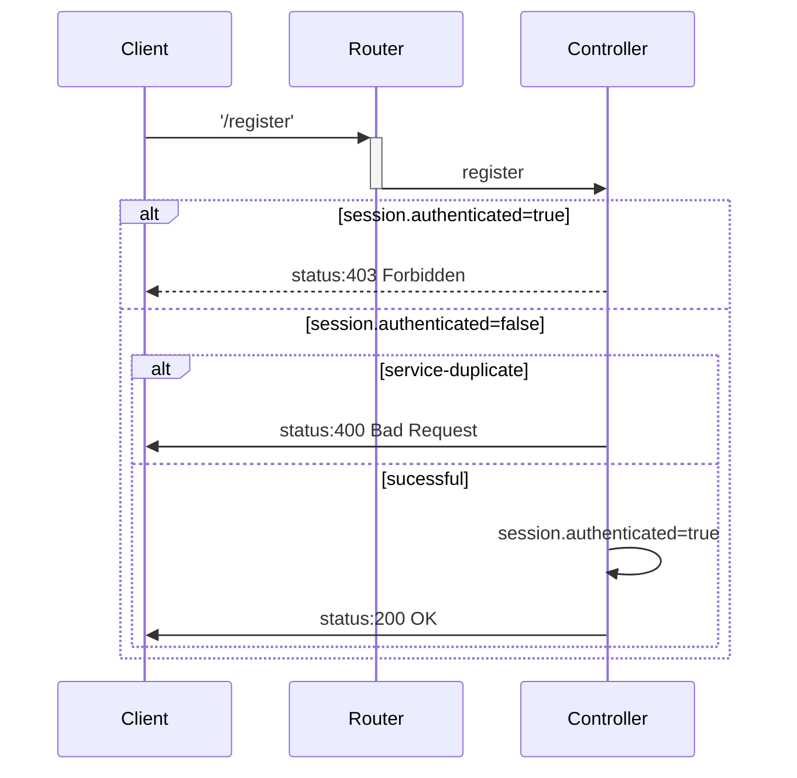
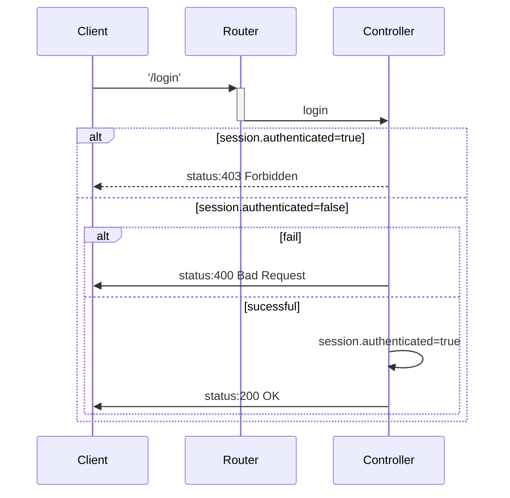
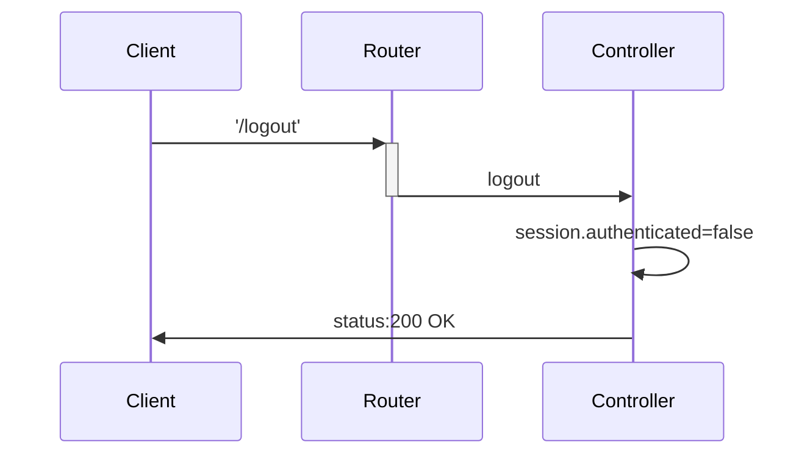

[TOC]

青芒后端，暂时支持内存中的store（也就是server关闭后数据丢失）。用户的登录与注册不检查字段的合法性。

# Usage

首先要安装node环境

然后cmd进入server的根目录

安装npm包依赖

```js
npm install
```

运行程序

```js
node index.js
```

测试

```js
npm test
```


# API Reference

**排版约定**

URL Example: */path/to/myfile.html?key1=value1&key2=value2*

> /path/to/myfile.html?key1=value1&key2=value2#SomewhereInTheDocument `HTTP方法`
>
> 描述该接口的含义balabala
>
> **Kind**（参数详解）
>
> **request**（这里写明HTTP请求的参数）
>
> （URL串里的参数）
>
> Param
>
> - **普通参数** -  该参数的含义是（URL里没有，不过你肯定懂的）
>
> Query
>
> - **key1** - key1的含义是....
> - **key2** - key2的含义是....
>
> Body
>
> Conten-Type: applicaition/json
>
> | Param    | Type   | Description      |
> | -------- | ------ | ---------------- |
> | <字段名> | <type> | 描述该字段的含义 |
>
> **response**（这里写HTTP响应的参数）
>
> status code（状态码）
>
> Body（载荷）

---

## /notifications/:username `GET`

获取历史好友通知列表

**Kind**

**request**

URL

| Param    | Description |
| -------- | ----------- |
| username | 用户名      |

**response**

status code

- `200 OK ` - 获取成功

Body

| Param          | Type     | Description                    |
| -------------- | -------- | ------------------------------ |
| -              | `Array`  | 好友通知数组                   |
| -[i]           | `Object` | 通知对象                       |
| -[i].applicant | `String` | 好友名                         |
| -[i].answer    | `Number` | -1: 已拒绝 0: 未处理 1: 已接受 |

**返回的数组挂载在Body上**

**Example**

```js
curl -v 127.0.0.1:3000/notifications/0003
```


---

## /friends/:username `GET`

获取好友列表，通过用户的username，查询用户的好友

**Kind**

**request**

URL

| Param    | Description |
| -------- | ----------- |
| username | 用户名      |

**response**

status code

- `200 OK ` - 获取成功

Body

| Param | Type     | Description  |
| ----- | -------- | ------------ |
| -     | `Array`  | 用户信息数组 |
| -[i]  | `String` | 用户名       |

**返回的数组挂载在Body上**

**Example**

```js
curl -v 127.0.0.1:3000/friends/0080
```

---

## /userinfo `POST`

获取资料接口，通过用户的username，查询用户信息

**Kind**

**request**

Body

| Param    | Type     | Description |
| -------- | -------- | ----------- |
| users    | `Array`  | 用户名数组  |
| users[i] | `String` | 用户名      |

**response**

status code

- `200 OK ` - 获取成功

Body

| Param           | Type     | Description        |
| --------------- | -------- | ------------------ |
| -               | `Array`  | 用户信息数组       |
| 若存在          |          |                    |
| -[i].user_id    | `String` | 用户名             |
| -[i].user_name  | `String` | 用户昵称           |
| -[i].user_photo | `String` | 用户头像           |
| 若不存在        |          |                    |
| -[i]            | `null`   | 没有该用户名的用户 |

**返回的数组挂载在Body上，且与查询的用户名数组一一对应**

**Example**

```js
curl -v 127.0.0.1:3000/userinfo -H "Content-Type: application/json" -d @test.json
```

---

## /userinfo/nickname `PUT`

设置昵称，通过用户的username，设置用户昵称为nickname

**Kind**

**request**

Body

| Param    | Type     | Description |
| -------- | -------- | ----------- |
| username | `String` | 用户名      |
| nickname | `String` | 昵称        |

**response**

status code

- `200 OK ` - 更新成功
- `400 Bad Request` - 更新失败

**Example**

```js
curl -v -X PUT 127.0.0.1:3000/userinfo/nickname -H "Content-Type: application/json" -d @test.json
```

---

## /userinfo/photo `PUT`

修改头像，通过用户的username，设置用户头像为photo

**Kind**

**request**

Body

| Param    | Type     | Description      |
| -------- | -------- | ---------------- |
| username | `String` | 用户名           |
| photo    | `String` | base64转码的头像 |

**response**

status code

- `200 OK ` - 更新成功
- `400 Bad Request` - 更新失败

**Example**

```js
curl -v -X PUT 127.0.0.1:3000/userinfo/photo -H "Content-Type: application/json" -d @test.json
```

---

## /register `POST`

用户注册

**Kind**

**request**

Body

| Param    | Type     | Description |
| -------- | -------- | ----------- |
| username | `String` | 用户名      |
| password | `String` | 密码        |
| nickname | `String` | 昵称        |

**response**

status code

- `200 OK ` - 用户注册成功
- `400 Bad Request`- 用户注册失败
- `403 Forbidden` - 当前用户未退出

**Example**

```js
curl -v 127.0.0.1:3000/register -b cookies.txt -c cookies.txt -H "Content-Type: application/json" -d @test.json
```

---

## /login `POST`

用户登录

**Kind**

**request**

Body

| Param    | Type     | Description |
| -------- | -------- | ----------- |
| username | `String` | 用户名      |
| password | `String` | 密码        |

**response**

status code

- `200 OK ` - 用户登录成功
- `400 Bad Request`- 用户登录失败
- `403 Forbidden` - 当前用户未退出

**Example**

```js
curl -v 127.0.0.1:3000/login -b cookies.txt -c cookies.txt -H "Content-Type: application/json" -d @test.json
```

---

## /logout `GET`

用户注销

**Kind**

**request**

(None)

**response**

status code

- `200 OK ` - 用户注销成功

**Example**

```js
curl -v 127.0.0.1:3000/logout -c cookies.txt
```

---


# Server Model

## Overview

The following sequence diagram indecates how modules work with each other.



## Router

路由器仅仅设置了<URL, controller.middleware>的匹配，支持的URL请参考API，controller请参考controller。


## Controller

用session来记录用户的登录情况。

**Controller.register**



**Controller.login(ctx, next)**



**Controller.logout**




## Service


## Query

